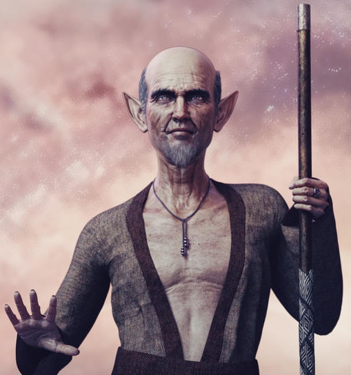

<html>

<b>Loron's Return</b>

<b>Quest mod for BG2EE and EET</b>

Original mod by Ajoc   
Loron's Return quest begins when Brus tells you about a mage in the Council building.

- New Quest
- New Monsters
- New Items
- Brand New Areas
- A couple of mini quests

  
  

 
&nbsp;

&nbsp;

</body>

</html>

